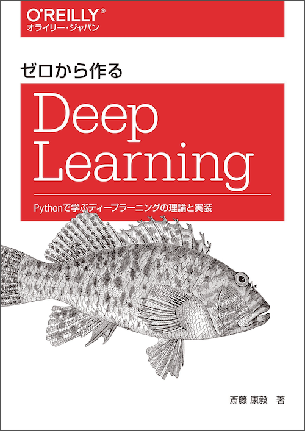

# ゼロから作る Deep Learning

---



---

本リポジトリはオライリー・ジャパン発行書籍『[ゼロから作る Deep Learning](http://www.oreilly.co.jp/books/9784873117584/)』のサポートサイトです。

## ファイル構成

|フォルダ名 |説明                         |
|:--        |:--                          |
|ch01       |1章で使用するソースコード    |
|ch02       |2章で使用するソースコード    |
|...        |...                          |
|ch08       |8章で使用するソースコード    |
|common     |共通で使用するソースコード   |
|dataset    |データセット用のソースコード |


ソースコードの解説は本書籍をご覧ください。

## 必要条件
ソースコードを実行するには、下記のソフトウェアがインストールされている必要があります。

* Python 3.x
* NumPy
* Matplotlib

※Pythonのバージョンは、3系を利用します。

## 実行方法

各章のフォルダへ移動して、Pythonコマンドを実行します。

```
$ cd ch01
$ python man.py

$ cd ../ch05
$ python train_nueralnet.py
```

## ライセンス

本リポジトリのソースコードは[MITライセンス](https://opensource.org/licenses/MIT)です。
商用・非商用問わず、自由にご利用ください。

## 正誤表

まだありません。誤植など間違いを見つけた方は、japan＠oreilly.co.jpまでお知らせください。
