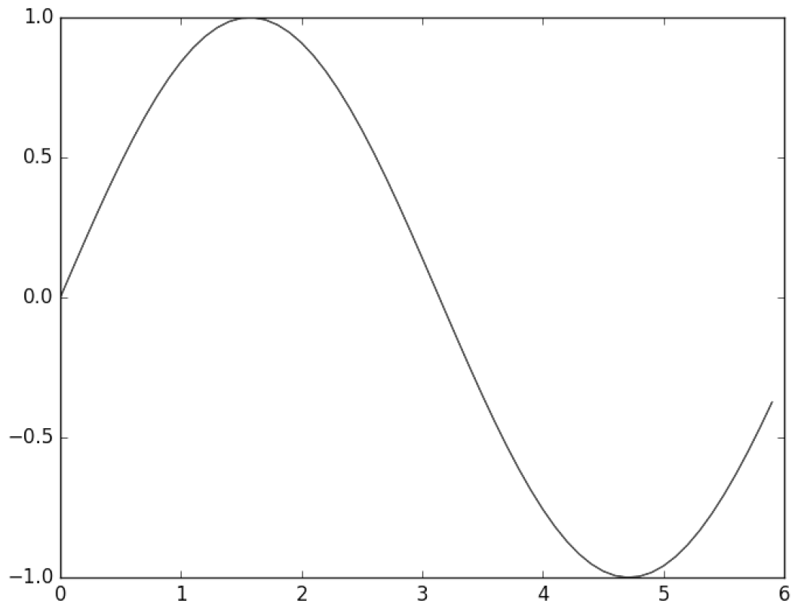
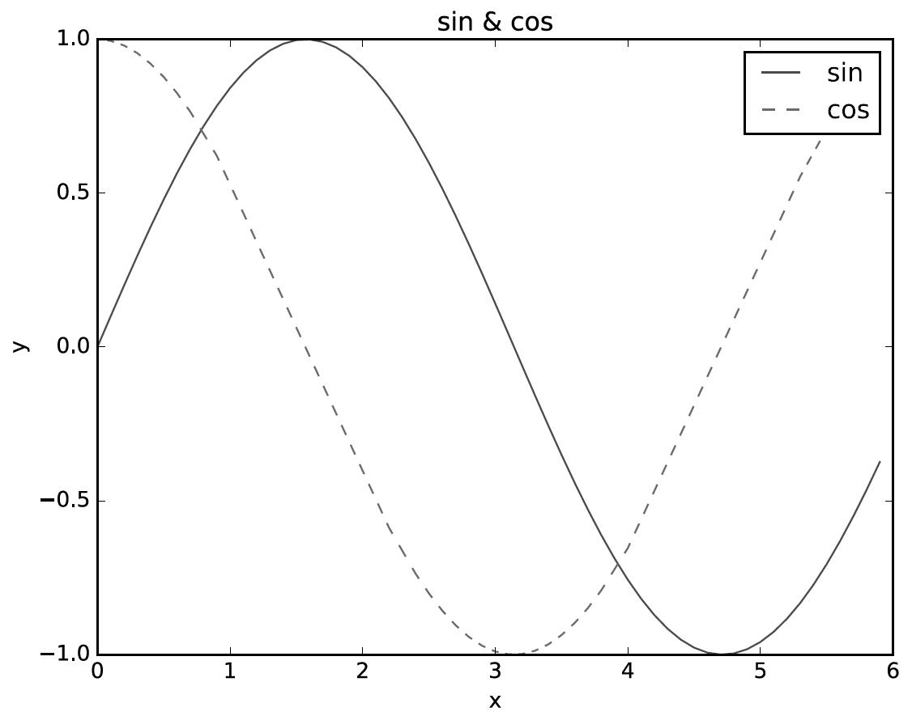

## 파일 설명
| 파일명 | 파일 용도 | 관련 절 | 페이지 |
|:--   |:--      |:--    |:--      |
| hungry.py | 단순한 문자열("I'm hungry!")을 출력합니다.| 1.4.1 파일로 저장하기 | 34 |
| img_show.py | 이미지를 화면에 보여줍니다. | 1.6.3 이미지 표시하기 | 44 |
| man.py | 파이썬 클래스 정의 예제입니다. | 1.4.2 클래스 | 35 |
| simple_graph.py | 그래프 그리기 예제입니다(sin_graph.py와 같음). | 1.6.1 단순한 그래프 그리기 | 42 |
| sin_cos_graph.py | 사인(sin) 그래프와 코사인(cos) 그래프를 그립니다. | 1.6.2 pyplot의 기능 | 43 |
| sin_graph.py | 사인(sin) 그래프를 그립니다. | 1.6.1 단순한 그래프 그리기 | 42 |

## 1장 헬로 파이썬
파이썬이라는 프로그래밍 언어가 세상에 등장한 지도 이미 20년이 훌쩍 넘었습니다. 그 사이 파이썬은 독자적인 진화를 이루며 많은 개발자를 끌어들였습니다. 그리고 현재는 가장 인기 있고 많은 사람이 애용하는 프로그래밍 언어가 되었습니다.

앞으로 파이썬을 사용하여 딥러닝 시스템을 구현할 것입니다. 그에 앞서 이번 장에서는 파이썬에 대해서 간략히 소개하면서 그 사용법을 익혀보겠습니다. 파이썬과 넘파이(_NumPy_) , matplotlib을 잘 아는 분은 이번 장을 건너뛰어도 상관없습니다.

> **목차**
```
1.1 파이썬이란?
1.2 파이썬 설치하기
__1.2.1 파이썬 버전
__1.2.2 사용하는 외부 라이브러리
__1.2.3 아나콘다 배포판
1.3 파이썬 인터프리터 
__1.3.1 산술 연산 
__1.3.2 자료형 
__1.3.3 변수 
__1.3.4 리스트 
__1.3.5 딕셔너리
__1.3.6 bool 
__1.3.7 if 문 
__1.3.8 for 문 
__1.3.9 함수 
1.4 파이썬 스크립트 파일 
__1.4.1 파일로 저장하기 
__1.4.2 클래스 
1.5 넘파이 
__1.5.1 넘파이 가져오기 
__1.5.2 넘파이 배열 생성하기 
__1.5.3 넘파이의 산술 연산 
__1.5.4 넘파이의 N차원 배열 
__1.5.5 브로드캐스트 
__1.5.6 원소 접근 
1.6 matplotlib 
__1.6.1 단순한 그래프 그리기 
__1.6.2 pyplot의 기능 
__1.6.3 이미지 표시하기
```

### 1.1 파이썬이란?
파이썬은 간단하고 배우기 쉬운 프로그래밍 언어입니다. 오픈 소스라 무료로 자유롭게 이용할 수도 있지요. 영어와 유사한 문법으로 프로그램을 작성할 수 있고 불편한 컴파일 과정도 없어서 편리합니다. 그래서 프로그래밍 입문자에게 최적인 언어입니다. 실제로도 많은 대학교의 컴퓨터 과학 관련 학과에서 처음 가르치는 언어로 파이썬을 채용하는 사례가 아주 많습니다.

또, 파이썬 코드는 읽기 쉽고 성능도 뛰어납니다. 데이터가 많거나 빠른 응답이 필요할 때도 파이썬은 제 몫을 톡톡히 해냅니다. 그래서 초보자뿐 아니라 전문가들도 애용하죠. 실제로 구글과 마이크로소프트, 페이스북 등 IT의 첨단에서 겨루는 기업들은 파이썬을 자주 사용하고 있답니다.

파이썬은 과학 분야, 특히 기계학습과 데이터 과학 분야에서 널리 쓰입니다. 파이썬 자체의 뛰어난 성능에 넘파이와 [사이파이(_SciPy_)](https://www.scipy.org/) 같은 수치 계산과 통계 처리를 다루는 탁월한 라이브러리가 더해져 데이터 과학 분야에서 확고한 위치를 차지하고 있죠. 나아가 딥러닝 프레임워크 쪽에서도 파이썬을 애용합니다. 예를 들어 [카페(_Caffe_)](http://caffe.berkeleyvision.org/), [텐서플로(_TensorFlow_)](https://www.tensorflow.org/), [체이너(_Chainer_)](http://chainer.org/), [테아노(_Theano_)](http://deeplearning.net/software/theano) 같은 유명 딥러닝 프레임워크들이 파이썬용 API를 제공합니다. 그래서 파이썬을 배우면 딥러닝 프레임워크를 사용할 때도 반드시 도움이 될 것입니다.

이처럼 파이썬은 특히 데이터 과학 분야에 아주 적합한 프로그래밍 언어입니다. 그래서 이 책의 목표인 ‘딥러닝을 밑바닥부터 만들기’를 달성하기 위한 언어로 선택된 것이죠.

### 1.2 파이썬 설치하기
그럼 파이썬을 PC에 설치합시다. 이번 절은 설치할 때 주의할 점을 설명합니다.

#### 1.2.1 파이썬 버전
현재의 파이썬은 2.x와 3.x라는 두 가지 버전이 공존합니다. 3 버전이 나왔지만 아직 2 버전도 많이 이용되고 있죠. 그래서 파이썬을 처음 배울 때는 어느 버전을 설치할지 신중하게 선택해야 합니다. 이 둘은 100% 호환되는 게 아니니까요(정확히 말하면 ‘하위 호환성’이 없습니다). 즉, 파이썬 3로 짠 프로그램을 파이썬 2에서는 실행하지 못하는 일이 일어납니다. 이 책에서는 파이썬 3를 사용합니다. 만약 파이썬 2만 설치했다면, 파이썬 3도 추가로 설치하시기 바랍니다.

#### 1.2.2 사용하는 외부 라이브러리
누차 강조했듯이 이 책의 목표는 딥러닝을 밑바닥부터 구현하는 것입니다. 그래서 외부 라이브러리는 최소한만 사용한다는 것이 기본 방침이지만, 다음의 두 라이브러리는 예외로 하겠습니다. 하나는 넘파이, 다른 하나는 matplotlib입니다. 이들 라이브러리를 사용하는 이유는 효율적으로 딥러닝을 구현하기 위해서입니다.

넘파이는 수치 계산용 라이브러리입니다. 넘파이에는 고도의 수학 알고리즘과 배열(행렬)을 조작하기 위한 편리한 메서드가 많이 준비되어 있습니다. 이들 메서드를 이용하면 딥러닝을 훨씬 효율적으로 구현할 수 있습니다.

matplotlib은 그래프를 그려주는 라이브러리입니다. matplotlib을 이용하면 실험 결과를 시각화하거나 딥러닝 실행 과정의 중간 데이터를 시각적으로, 즉 눈으로 확인할 수 있습니다. 이 책에서는 이러한 라이브러리를 사용하여 딥러닝을 구현합니다.

> **노트:** 이 책에서는 다음의 프로그래밍 언어와 라이브러리를 사용합니다.
* 파이썬 3
* 넘파이
* matplotlib

다음으로 파이썬 설치 방법을 설명합니다. 이미 설치한 분은 건너뛰시면 됩니다.

#### 1.2.3 아나콘다 배포판
파이썬을 설치하는 방법은 다양하지만, 이 책에서는 아나콘다Anaconda라는 배포판을 이용하기를 권합니다. 배포판이란 사용자가 설치를 한 번에 수행할 수 있도록 필요한 라이브러리 등을 하나로 정리해둔 것입니다. 그중 아나콘다는 데이터 분석에 중점을 둔 배포판입니다. 방금 설명한 넘파이와 matplotlib을 포함해 데이터 분석에 유용한 라이브러리가 포함되어 있습니다.

앞서 말한 것처럼 이 책에서는 파이썬 3를 사용합니다. 그래서 아나콘다 배포판도 3 버전용을 설치합니다. 그럼, 다음 주소에서 자신의 OS에 맞는 배포판을 내려받아 설치하세요.

> https://www.continuum.io/downloads

### 1.3 파이썬 인터프리터
파이썬을 설치했다면 파이썬 버전을 먼저 확인합니다. 터미널에서 python --version 명령어를 실행해보세요. 이 명령은 설치된 파이썬의 버전을 출력합니다.

```
$ python --version
Python 3.5.2 :: Anaconda 4.2.0 (x86 _64)
```

이처럼 “Python 3.x.x”라 표시되면 파이썬 3가 제대로 설치된 것입니다(설치한 버전에 따라 숫자는 달라지겠죠?). 이어서 python이라고 입력하여 파이썬 인터프리터를 시작해보세요.

```
$ python
Python 3.5.2 |Anaconda 4.2.0 (x86 _64)| (default, Jul 2 2016, 17:52:12)
[GCC 4.2.1 Compatible Apple LLVM 4.2 (clang-425.0.28)] on darwin
Type "help", "copyright", "credits" or "license" for more information.
>>>
```

파이썬 인터프리터는 ‘대화 모드’라 하여, 개발자와 파이썬이 대화하듯 프로그래밍할 수 있습니다. ‘대화하듯’이라는 것은, 예를 들면 개발자가 “1+2는?”이라고 물으면 파이썬 인터프리터가 곧바로 “3입니다”라고 대답한다는 의미입니다. 그럼 실제로 입력해보겠습니다.

```python
>>> 1 + 2
3
```

이처럼 파이썬 인터프리터에서는 대화식으로 프로그래밍할 수 있습니다. 이번 장에서는 이 대화 모드를 사용하여 파이썬 프로그래밍을 간단히 실습해보려 합니다.

#### 1.3.1 산술 연산
덧셈과 곱셈 등의 산술 연산은 다음과 같이 할 수 있습니다.

```python
>>> 1 - 2
-1
>>> 4 * 5
20
>>> 7 / 5
1.4
>>> 3 ** 2
9
```

*은 곱셈, /는 나눗셈, **는 거듭제곱을 의미합니다(3 ** 2는 3의 2제곱). 참고로, 파이썬 2에서는 정수끼리 계산한 결과는 정수입니다. 예를 들어 7 ÷ 5의 결과는 1입니다. 한편, 파이썬 3에서는 정수를 나눈 결과는 실수(부동소수점 수)가 됩니다.

#### 1.3.2 자료형
프로그래밍 언어에는 **자료형**(_data type_)이라는 것이 있습니다. 자료형이란 데이터의 성질을 나타내는 것으로, 예를 들어 정수, 실수, 문자열과 같은 형태가 있습니다. 파이썬에는 type() 함수로 특정 데이터의 자료형을 알아볼 수 있습니다.

```python
>>> type(10)
<class 'int'>
>>> type(2.718)
<class 'float'>
>>> type("hello")
<class 'str'>
```

즉, 10은 int(정수), 2.718은 float(실수), “hello”는 str(문자열)형임을 알 수 있습니다. 또한 자료형과 클래스(_class_)라는 말을 같은 의미로 사용하는 경우가 있습니다. 방금 예에서의 <class ‘int’>는 “10은 int라는 클래스(자료형)다”로 해석하면 됩니다.

#### 1.3.3 변수
x와 y 등의 알파벳을 사용하여 **변수**(_variable_)를 정의할 수 있습니다. 또한, 변수를 사용하여 계산하거나 변수에 다른 값을 대입할 수도 있습니다.

```python
>>> x = 10   # 초기화
>>> print(x) # x의 값 출력
10
>>> x = 100  # 변수에 값 대입
>>> print(x)
100
>>> y = 3.14
>>> x * y
314.0
>>> type(x * y)
<class 'float'>
```

파이썬은 **동적 언어**로 분류되는 프로그래밍 언어입니다. 동적이라 함은 변수의 자료형을 상황에 맞게 자동으로 결정한다는 뜻입니다. 앞의 예에서 x의 자료형이 int (정수)라는 것을 사용자가 명시한 적이 없죠? 하지만 10이라는 정수로 초기화할 때, x의 형태가 int임을 파이썬이 스스로 판단하는 것입니다. 또, 정수와 실수를 곱한 결과는 실수가 되었습니다(자동 형변환). 마지막으로 #은 주석의 시작을 알리는 문자입니다. # 이후의 문자는 모두 무시해버립니다.

#### 1.3.4 리스트
여러 데이터를 **리스트**(_list_)로도 정리할 수 있습니다.

```python
>>> a = [1, 2, 3, 4, 5] # 리스트 생성
>>> print(a)  # 리스트의 내용 출력
[1, 2, 3, 4, 5]
>>> len(a     # 리스트의 길이 출력
5
>>> a[0]      # 첫 원소에 접근
1
>>> a[4]      # 다섯 번째 원소에 접근
5
>>> a[4] = 99 # 값 대입
>>> print(a)
[1, 2, 3, 4, 99]
```

원소에 접근할 때는 a[0]처럼 합니다. [] 안의 수를 인덱스(색인)라 하며 인덱스는 0부터 시작합니다(인덱스 0이 첫 번째 원소를 가리킵니다). 또 파이썬 리스트에는 **슬라이싱**(_slicing_)이라는 편리한 기법이 준비되어 있습니다. 슬라이싱을 이용하면 범위를 지정해 원하는 부분 리스트를 얻을 수 있습니다.

```python
>>> print(a)
[1, 2, 3, 4, 99]
>>> a[0:2] # 인덱스 0부터 2까지 얻기(2번째는 포함하지 않는다!)
[1, 2]
>>> a[1:]  # 인덱스 1부터 끝까지 얻기
[2, 3, 4, 99]
>>> a[:3]  # 처음부터 인덱스 3까지 얻기(3번째는 포함하지 않는다!)
[1, 2, 3]
>>> a[:-1] # 처음부터 마지막 원소의 1개 앞까지 얻기
[1, 2, 3, 4]
>>> a[:-2] # 처음부터 마지막 원소의 2개 앞까지 얻기
[1, 2, 3]
```

리스트를 슬라이싱하려면 a[0:2]처럼 씁니다. a[0:2]는 인덱스 0부터 1(2보다 하나 앞)까지의 원소를 꺼냅니다. 인덱스 번호 -1은 마지막 원소, -2는 끝에서 한 개 앞의 원소에 해당합니다.

#### 1.3.5 딕셔너리
리스트는 인덱스 번호로 0, 1, 2, ... 순으로 값을 저장하는 반면, **딕셔너리**(_dictionary_)는 키(_key_)와 값(_value_)을 한 쌍으로 저장합니다. 즉, 영한사전처럼 단어와 그 의미를 짝지어 저장합니다.

```python
>>> me = {'height':180} # 딕셔너리 생성
>>> me['height']        # 원소에 접근
180
>>> me['weight'] = 70   # 새 원소 추가
>>> print(me)
{'weight': 70, 'height': 180}
```

#### 1.3.6 bool
파이썬에는 **bool**(_불 혹은 불리언_)이라는 자료형이 있습니다. 이 자료형은 True(참)와 False(거짓)라는 두 값 중 하나를 취합니다. 또 bool에는 and, or, not 연산자를 사용할 수 있습니다(수치용 연산자로는 +, -, *, / 등이 있듯이 자료형에 따라 사용할 수 있는 연산자가 정해져 있습니다).

```python
>>> hungry = True     # 배가 고프다.
>>> sleepy = False    # 졸리지 않다.
>>> type(hungry)
<class 'bool'>
>>> not hungry
False
>>> hungry and sleepy # 배가 고프다 그리고 졸리지 않다.
False
>>> hungry or sleepy  # 배가 고프다 또는 졸리지 않다.
True
```

#### 1.3.7 if 문
조건에 따라서 달리 처리하려면 **if/else 문**을 사용합니다.

```python
>>> hungry = True
>>> if hungry:
...     print("I'm hungry")
...
I'm hungry
>>> hungry = False
>>> if hungry:
...     print("I'm hungry")   # 들여쓰기는 공백 문자로
... else:
...     print("I'm not hungry")
...     print("I'm sleepy")
...
I'm not hungry
I'm sleepy
```

파이썬에서는 공백 문자가 중요한 의미를 지닙니다. 이번 if 문에서도 if hungry: 다음 줄은 앞쪽에 4개의 공백 문자가 있습니다. 이 들여쓰기는 지난 조건(if hungry)이 충족될 때 실행되는 코드를 표현합니다.

> **주의:** 공백 대신 탭(_tab_) 문자를 써도 되지만 파이썬에서는 공백 문자 쪽을 권장합니다. 그리고 한 단계 더 들여 쓸 때마다 공백 4개씩을 더 추가하는 것이 일반적입니다.

#### 1.3.8 for 문
반복(루프) 처리에는 **for 문**을 사용합니다.

```python
>>> for i in[1, 2, 3]:
...     print(i)
...
1
2
3
```

여기에서는 [1, 2, 3]이라는 리스트 안의 원소를 하나씩 출력하는 예를 보여줬습니다. for ... in ... : 구문을 사용하면 리스트 등 데이터 집합의 각 원소에 차례로 접근할 수 있습니다.

#### 1.3.9 함수
특정 기능을 수행하는 일련의 명령들을 묶어 하나의 **함수**(_function_)로 정의할 수 있습니다.

```python
>>> def hello():
...     print("Hello World!")
...
>>> hello()
Hello World!
```

함수는 인수를 취할 수 있습니다. 또한, + 연산자를 사용하여 문자열을 이어 붙일 수 있습니다.

```python
>>> def hello(object):
...     print("Hello " + object + "!")
...
>>> hello("cat")
Hello cat!
```

파이썬 인터프리터를 종료하려면 리눅스와 맥에서는 Ctrl + D(Ctrl 키를 누른 상태에서 D 키를 누른다)를 입력합니다. 윈도우에서는 Ctrl + Z를 입력하고 키를 누릅니다.

### 1.4 파이썬 스크립트 파일
지금까지 파이썬 인터프리터를 활용하는 예를 보았습니다. 파이썬 인터프리터는 파이썬 코드를 대화식으로 실행해보며 간단한 실험을 수행하기에 딱 좋습니다. 그러나 긴 작업을 수행해야 한다면, 매번 코드를 입력해야 하는 이 방식은 조금 불편하겠죠. 이럴 때는 파이썬 프로그램을 파일로 저장하고 그 파일을 (함께) 실행하는 방법이 있습니다. 이번 절에서는 그런 파이썬 스크립트 파일의 예를 살펴보겠습니다.

#### 1.4.1 파일로 저장하기
텍스트 편집기를 열고 hungry.py라는 파일을 작성합니다. hungry.py는 다음의 한 줄만으로 구성된 파일입니다.

```python
print("I'm hungry!")
```

이어서 터미널을 열고 앞의 hungry.py를 저장한 디렉터리로 이동합니다. 그런 다음 파일 이름인 “hungry.py”를 인수로 python 명령을 실행합니다. 여기에서는 hungry.py가 ~/deep-learning-from-scratch/ch01 디렉터리에 있다고 가정합니다.

```
$ cd ~/deep-learning-from-scratch/ch01 # 디렉터리로 이동
$ python hungry.py
I'm hungry!
```

이처럼 파이썬 코드를 담은 파일을 인수로 지정해 파이썬 프로그램을 실행할 수 있습니다.

#### 1.4.2 클래스
지금까지 int와 str 등의 자료형을 살펴봤습니다(그리고 type ( ) 함수로는 원하는 데이터의 자료형을 알아낼 수 있었죠). 이들은 내장된 자료형, 즉 파이썬이 기본으로 제공하는 자료형입니다. 이번 절에서는 새로운 **클래스**를 정의합니다. 개발자가 직접 클래스를 정의하면 독자적인 자료형을 만들 수 있습니다. 또한, 클래스에는 그 클래스만의 전용 함수(메서드)와 속성을 정의할 수도 있습니다.

파이썬에서는 class라는 키워드를 사용하여 클래스를 정의합니다. 클래스의 구조는 다음과 같습니다.

```python
class 클래스 이름:
    def __init__(self, 인수, ...): # 생성자
        ...
    def 메서드 이름 1(self, 인수, ...): # 메서드 1
        ...
    def 메서드 이름 2(self, 인수, ...): # 메서드 2
        ...
```

클래스 정의에는 **\_\_init\_\_**라는 특별한 메서드가 있는데, 클래스를 초기화하는 방법을 정의합니다. 이 초기화용 메서드를 **생성자**(_constructor_)라고도 하며, 클래스의 인스턴스가 만들어질 때 한 번만 불립니다. 또, 파이썬에서는 메서드의 첫 번째 인수로 자신(자신의 인스턴스)을 나타내는 self를 명시적으로 쓰는 것이 특징입니다(다른 언어를 쓰던 사람은 이처럼 self를 쓰는 규칙을 기묘하게 느낄지도 모르겠네요).

그럼 간단한 클래스를 하나 만들어보겠습니다. 다음 코드를 man.py 파일로 저장하세요.

```python
class Man:
    def __init__(self, name):
        self.name = name
        print("Initialized!")

    def hello(self):
        print("Hello " + self.name + "!")

    def goodbye(self):
        print("Good-bye " + self.name + "!")

m = Man("David")
m.hello()
m.goodbye()
```

이제 터미널에서 man.py를 실행합니다.

```
$ python man.py
Initialized!
Hello David!
Good-bye David!
```

여기에서는 Man이라는 새로운 클래스를 정의했습니다. 그리고 Man 클래스에서 m이라는 인스턴스(객체)를 생성합니다.

Man의 생성자(초기화 메서드)는 name이라는 인수를 받고, 그 인수로 인스턴스 변수인 self.name을 초기화합니다. **인스턴스 변수**는 인스턴스별로 저장되는 변수입니다. 파이썬에서는 self.name처럼 self 다음에 속성 이름을 써서 인스턴스 변수를 작성하거나 접근할 수 있습니다.

### 1.5 넘파이
딥러닝을 구현하다 보면 배열이나 행렬 계산이 많이 등장합니다. **넘파이**의 배열 클래스인 numpy.array에는 편리한 메서드가 많이 준비되어 있어, 딥러닝을 구현할 때 이들 메서드를 이용합니다. 이번 절에서는 앞으로 사용할 넘파이에 대해서 간략히 설명합니다.

#### 1.5.1 넘파이 가져오기
넘파이는 외부 라이브러리입니다. 여기서 말하는 ‘외부’는 표준 파이썬에는 포함되지 않는다는 것입니다. 그래서 우선 넘파이 라이브러리를 쓸 수 있도록 가져와야(_import_) 합니다.

```python
>>> import numpy as np
```

파이썬에서는 라이브러리를 읽기 위해서 import 문을 이용합니다. 여기에서는 import numpy as np라고 썼는데, 직역하면 “numpy를 np라는 이름으로 가져와라”가 됩니다. 이렇게 해두면 앞으로 넘파이가 제공하는 메서드를 np를 통해 참조할 수 있습니다.

#### 1.5.2 넘파이 배열 생성하기
**넘파이 배열**을 만들 때는 np.array ( ) 메서드를 이용합니다. np.array ( )는 파이썬의 리스트를 인수로 받아 넘파이 라이브러리가 제공하는 특수한 형태의 배열(numpy.ndarray )을 반환합니다.

```python
>>> x = np.array([1.0, 2.0, 3.0])
>>> print(x)
[1. 2. 3.]
>>> type(x)
<class 'numpy.ndarray'>
```

#### 1.5.3 넘파이의 산술 연산
다음은 넘파이 배열로 산술 연산을 수행하는 예입니다.

```python
>>> x = np.array([1.0, 2.0, 3.0])
>>> y = np.array([2.0, 4.0, 6.0])
>>> x + y # 원소별 덧셈
array([ 3., 6., 9.])
>>> x - y
array([ -1., -2., -3.])
>>> x * y # 원소별 곱셈
array([ 2., 8., 18.])
>>> x / y
array([ 0.5, 0.5, 0.5])
```

여기에서 주의할 점은 배열 x와 y의 원소 수가 같다는 것입니다(둘 다 원소를 3개씩 갖는 1차원 배열). x와 y의 원소 수가 같다면 산술 연산은 각 원소에 대해서 행해집니다. 원소 수가 다르면 오류가 발생하니 원소 수 맞추기는 중요하답니다. 참고로, ‘원소별’이라는 말은 영어로 element-wise라고 합니다. 예컨대 ‘원소별 곱셈’은 element-wise product라고 합니다.

넘파이 배열은 원소별 계산뿐 아니라 넘파이 배열과 수치 하나(스칼라값)의 조합으로 된 산술 연산도 수행할 수 있습니다. 이 경우 스칼라값과의 계산이 넘파이 배열의 원소별로 한 번씩 수행됩니다. 이 기능을 **브로드캐스트**라고 합니다(자세한 것은 1.5.5절에서 설명하겠습니다).

```python
>>> x = np.array([1.0, 2.0, 3.0])
>>> x / 2.0
array([ 0.5, 1., 1.5])
```

#### 1.5.4 넘파이의 N차원 배열
넘파이는 1차원 배열(1줄로 늘어선 배열)뿐 아니라 다차원 배열도 작성할 수 있습니다. 예를 들어 2차원 배열(행렬)은 다음처럼 작성합니다.

```python
>>> A = np.array([[1, 2], [3, 4]])
>>> print(A)
[[1 2]
 [3 4]]
>>> A.shape
(2, 2)
>>> A.dtype
dtype('int64')
```

방금 2×2의 A라는 행렬을 작성했습니다. 행렬의 형상은 shape으로, 행렬에 담긴 원소의 자료형은 dtype으로 알 수 있습니다. 이어서 행렬의 산술 연산을 봅시다.

> **옮긴이:** 이 책에서는 행렬을 포함한 N차원 배열에서 그 배열의 ‘각 차원의 크기(원소 수)’를 배열의 ‘형상’이라 하겠습니다.


```python
>>> B = np.array([[3, 0], [0, 6]])
>>> A + B
array([[ 4, 2],
       [ 3, 10]])
>>> A * B
array([[ 3, 0],
       [ 0, 24]])
```

형상이 같은 행렬끼리면 행렬의 산술 연산도 대응하는 원소별로 계산됩니다. 배열과 마찬가지로 말이죠. 행렬과 스칼라값의 산술 연산도 가능합니다. 이때도 배열과 마찬가지로 브로드캐스트 기능이 작동합니다.

```python
>>> print(A)
[[1 2]
 [3 4]]
>>> A * 10
array([[ 10, 20],
       [ 30, 40]])
```

> **노트:** 넘파이 배열(np.array )은 N차원 배열을 작성할 수 있습니다. 1차원 배열, 2차원 배열, 3차원 배열처럼 원하는 차수의 배열을 만들 수 있다는 뜻입니다. 수학에서는 1차원 배열은 **벡터**(_vector_), 2차원 배열은 **행렬**(_matrix_)이라고 부릅니다. 또 벡터와 행렬을 일반화한 것을 **텐서**(_tensor_)라 합니다. 이 책에서는 기본적으로 2차원 배열을 ‘행렬’, 3차원 이상의 배열을 ‘다차원 배열’이라 하겠습니다.

#### 1.5.5 브로드캐스트
넘파이에서는 형상이 다른 배열끼리도 계산할 수 있습니다. 앞의 예에서는 2×2 행렬 A에 스칼라값 10을 곱했습니다. 이때 [그림 1-1]과 같이 10이라는 스칼라값이 2×2 행렬로 확대된 후 연산이 이뤄집니다. 이 똑똑한 기능을 **브로드캐스트**(_broadcast_)라고 합니다.

**그림 1-1** 브로드캐스트의 예 : 스칼라값인 10이 2×2 행렬로 확대된다.


다른 예를 살펴봅시다.

```python
>>> A = np.array([[1, 2], [3, 4]])
>>> B = np.array([10, 20])
>>> A * B
array([[ 10, 40],
       [ 30, 80]])
```

여기에서는 [그림 1-2]처럼 1차원 배열인 B가 ‘똑똑하게도’ 2차원 배열 A와 똑같은 형상으로 변형된 후 원소별 연산이 이뤄집니다.

**그림 1-2** 브로드캐스트의 예 2


이처럼 넘파이가 제공하는 브로드캐스트 기능 덕분에 형상이 다른 배열끼리의 연산을 스마트하게 할 수 있습니다.

#### 1.5.6 원소 접근
원소의 인덱스는 0부터 시작합니다(기억하시죠?). 그리고 각 원소에 접근하려면 다음과 같이 합니다.

```python
>>> X = np.array([[51, 55], [14, 19], [0, 4]])
>>> print(X)
[[51 55]
 [14 19]
 [ 0 4]]
>>> X[0]     # 0행
array([51, 55])
>>> X[0][1]  # (0, 1) 위치의 원소
55
```

for 문으로도 각 원소에 접근할 수 있습니다.

```python
>>> for row in X:
...     print(row)
...
[51 55]
[14 19]
[0 4]
```

넘파이는 지금까지의 방법 외에도, 인덱스를 배열로 지정해 한 번에 여러 원소에 접근할 수도 있습니다.

```python
>>> X = X.flatten()        # X를 1차원 배열로 변환(평탄화)
>>> print(X)
[51 55 14 19 0 4]
>>> X[np.array([0, 2, 4])] # 인덱스가 0, 2, 4인 원소 얻기
array([51, 14, 0])
```

이 기법을 응용하면 특정 조건을 만족하는 원소만 얻을 수 있습니다. 예컨대 다음과 같이 배열 X에서 15 이상인 값만 구할 수 있습니다.

```python
>>> X > 15
array([ True, True, False, True, False, False], dtype = bool)
>>> X[X>15]
array([51, 55, 19])
```

넘파이 배열에 부등호 연산자를 사용한(앞 예에서 X>15) 결과는 bool 배열입니다. 여기에서는 이 bool 배열을 사용해 배열 X에서 True에 해당하는 원소, 즉 값이 15보다 큰 원소만 꺼내고 있습니다.

> **노트:** 파이썬 같은 동적 언어는 C나 C++ 같은 정적 언어(컴파일 언어)보다 처리 속도가 늦다고 합니다. 실제로 무거운 작업을 할 때는 C/C++로 작성한 프로그램을 쓰는 편이 좋습니다. 그래서 파이썬에서 빠른 성능이 요구될 경우 해당 부분을 C/C++로 구현하곤 합니다. 그때 파이썬은 C/C++로 쓰인 프로그램을 호출해주는, 이른바 ‘중개자’ 같은 역할을 합니다. 넘파이도 주된 처리는 C와 C++로 구현했습니다. 그래서 성능을 해치지 않으면서 파이썬의 편리한 문법을 사용할 수 있는 것이죠.

### 1.6 matplotlib
딥러닝 실험에서는 그래프 그리기와 데이터 시각화도 중요하답니다. **matplotlib**은 그래프를 그려주는 라이브러리입니다. matplotlib을 사용하면 그래프 그리기와 데이터 시각화가 쉬워집니다. 이번 절에서는 그래프를 그리고 이미지를 화면에 표시하는 방법을 설명합니다.

#### 1.6.1 단순한 그래프 그리기
그래프를 그리려면 matplotlib의 **pyplot** 모듈을 이용합니다. 당장 sin 함수를 그리는 예를 살펴봅시다.

```python
import numpy as np
import matplotlib.pyplot as plt

# 데이터 준비
x = np.arange(0, 6, 0.1) # 0에서 6까지 0.1 간격으로 생성
y = np.sin(x)

# 그래프 그리기
plt.plot(x, y)
plt.show()
```

이 코드에서는 넘파이의 arange 메서드로 [0, 0.1, 0.2, ..., 5.8, 5.9]라는 데이터를 생성하여 변수 x에 할당했습니다. 그다음 줄에서는 x의 각 원소에 넘파이의 sin 함수인 np.sin ( )을 적용하여 변수 y에 할당합니다. 이제 x와 y를 인수로 plt.plot 메서드를 호출해 그래프를 그립니다. 마지막으로 plt.show( )를 호출해 그래프를 화면에 출력하고 끝납니다. 이 코드를 실행하면 [그림 1-3]의 이미지가 그려집니다.

**그림 1-3** sin 함수 그래프


#### 1.6.2 pyplot의 기능
여기에 cos 함수도 추가로 그려보겠습니다. 또, 제목과 각 축의 이름(레이블) 표시 등, **pyplot**의 다른 기능도 사용해보겠습니다.

```python
import numpy as np
import matplotlib.pyplot as plt

# 데이터 준비
x = np.arange(0, 6, 0.1) # 0에서 6까지 0.1 간격으로 생성
y1 = np.sin(x)
y2 = np.cos(x)

# 그래프 그리기
plt.plot(x, y1, label="sin")
plt.plot(x, y2, linestyle = "--", label="cos") # cos 함수는 점선으로 그리기
plt.xlabel("x")        # x축 이름
plt.ylabel("y")        # y축 이름
plt.title('sin & cos') # 제목
plt.legend()
plt.show()
```

결과는 [그림 1-4]와 같습니다. 그래프의 제목과 축 이름이 보일 겁니다.

**그림 1-4** sin 함수와 cos 함수 그래프


#### 1.6.3 이미지 표시하기
pyplot에는 이미지를 표시해주는 메서드인 imshow()도 준비되어 있습니다. 이미지를 읽어들일 때는 matplotlib.image 모듈의 imread() 메서드를 이용합니다. 예를 보시죠.

```python
import matplotlib.pyplot as plt
from matplotlib.image import imread

img = imread('cactus.png') # 이미지 읽어오기(적절한 경로를 설정하세요!)

plt.imshow(img)
plt.show()
```

이 코드를 실행하면 [그림 1-5]처럼 읽어들인 이미지가 표시됩니다.

**그림 1-5** 이미지 표시하기


앞의 코드에서는 cactus.png라는 이미지 파일이 현재 작업 디렉터리에 있다고 가정했습니다. 여러분은 자신의 환경에 맞게 파일 이름과 경로를 적절히 수정해야 합니다. 이 책이 제공하는 소스 코드에서는 dataset 디렉터리에서 이 cactus.png 파일을 찾을 수 있습니다. 예를 들어 파이썬 인터프리터로 ch01 디렉터리에서 이 코드를 실행한다면 이미지 경로를 ‘cactus.png’에서 ‘../dataset/cactus.png’로 변경하면 올바르게 작동합니다.

### 1.7 정리
이번 장은 딥러닝으로의 본격적인 여정을 위한 준비 과정입니다. 특히, 딥러닝(신경망)을 구현하는 데 필요한 프로그래밍의 기본을 중심으로 살펴보았습니다. 다음 장에서 파이썬으로 실제로 작동하는 코드를 작성해보면서 딥러닝의 세계로 떠나볼 겁니다.

이번 장에서는 파이썬에 대해 우리에게 필요한 최소한만 설명했습니다. 더 깊게 알고 싶은 분을 위해 좋은 책을 두 권 소개해드리죠. 먼저 [『처음 시작하는 파이썬』(한빛미디어, 2015)](http://www.hanbit.co.kr/store/books/look.php?p_code=B2827459900)입니다. 이 책은 파이썬 프로그래밍을 기초부터 응용까지 친절하게 설명해주는 실천적인 입문서입니다. 넘파이에 대해서는 [『파이썬 라이브러리를 활용한 데이터 분석』(한빛미디어, 2013)](http://www.hanbit.co.kr/store/books/look.php?p_code=B6540908288)을 추천합니다. 책 외에는 [Scipy 강의 노트](http://www.turbare.net/transl/scipy-lecture-notes/index.html)라는 웹 사이트가 과학 기술에서의 계산을 주제로 넘파이와 matplotlib을 잘 설명하고 있으니 참고하시기 바랍니다.


> **이번 장에서 배운 내용**
* 파이썬은 간단하고 익히기 쉬운 프로그래밍 언어다.
* 파이썬은 오픈 소스여서 자유롭게 사용할 수 있다.
* 이 책은 딥러닝 구현에 파이썬 3 버전을 이용한다.
* 외부 라이브러리로는 넘파이와 matplotlib을 이용한다.
* 파이썬을 실행하는 방식에는 ‘인터프리터’와 ‘스크립트 파일’ 두 가지가 있다.
* 파이썬에서는 함수와 클래스 같은 모듈로 구현을 정리할 수 있다.
* 넘파이는 다차원 배열을 다루는 편리한 메서드를 많이 제공한다.
