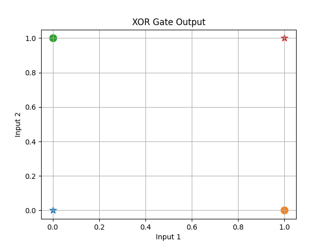
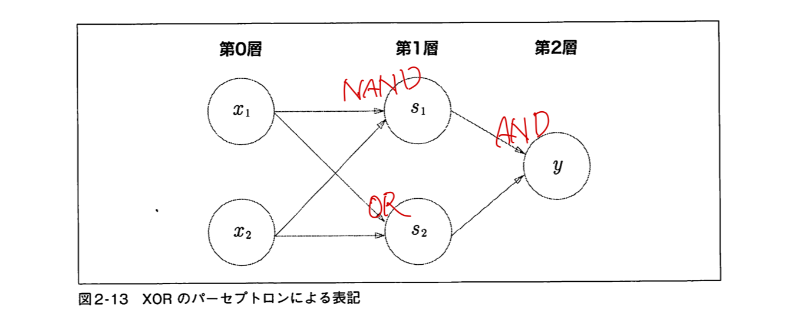

# 2章 パーセプトロン
>パーセプトロンとは、複数の信号を入力として受け取り、一つの信号を出力する

これが何層にもなっている。
機械学習では、パーセプトロンにおけるパラメーター（重みや閾値）をコンピュータが行う。

- 重みは各入力信号の重要度
- バイアスは発火しやすさ

## パーセプトロンの限界
パーセプトロンを用いることでAND、NAND、ORの3つの論理回路を実装することはできる。
しかし、XORは実現することができない。
なぜなら線形ではないから。
（以下のグラフにおいて、同種類の点を直線で分割することができない。）


では、どうしたら良いのか。

確か、計算機工学の授業で、XORはANDとNANDとORを使うことで表現できたような？？

てことは、その三つのパーセプトロンを組み合わせることで、XORを表現できるのできるんじゃね。

## 多層パーセプトロン
pythonでXORをAND NAND ORを使って実装する。
```python
def XOR(x1, x2):
    s1 = NAND(x1, x2) # NAND GATE
    s2 = OR(x1, x2)   # OR GATE
    y = AND(s1, s2)   # AND GATE
    return y
```
図にするとこんな感じ。（from 34p）


